# 🚖 Uber Trip Analysis Project

This project focuses on analyzing Uber trip data through **Exploratory Data Analysis (EDA)**, **Predictive Modeling** using XGBoost, and creating interactive **Power BI dashboards** for actionable insights.

---

## 📌 **Project Structure**
Uber_Trip_Analysis_Project/
│
├── data/ # Raw datasets
├── notebooks/ # Jupyter notebooks for EDA & modeling
├── models/ # Trained ML models
├── outputs/ # EDA plots and predictions
├── dashboards/ # Dashboard images
├── PowerBI/ # Power BI file (.pbix)
└── README.md # Project documentation

---

## ✅ **Project Highlights**
- **Exploratory Data Analysis (EDA):** Visualized trip patterns, demand trends, correlations.
- **Predictive Modeling:** Implemented **XGBoost Regression** to forecast trips.
- **Power BI Dashboards:** Interactive dashboards for trip analysis and performance insights.
- **Metrics:** Evaluated with MAE and RMSE for accuracy.

---

## 📊 **Dataset Details**
- **Files Used:**
  - `Uber-Jan-Feb-FOIL.csv`
  - `uber-raw-data-apr14.csv`
- Columns include: `Date/Time`, `Lat`, `Lon`, `Base`, `Trips`, `Active Vehicles`, etc.

---

## 🔍 **Tools & Technologies**
- **Language:** Python  
- **Libraries:** pandas, numpy, matplotlib, seaborn, xgboost  
- **Visualization:** Power BI  
- **IDE:** Jupyter Notebook, VS Code  

---

## 📊 **Exploratory Data Analysis**
### Key Visualizations:
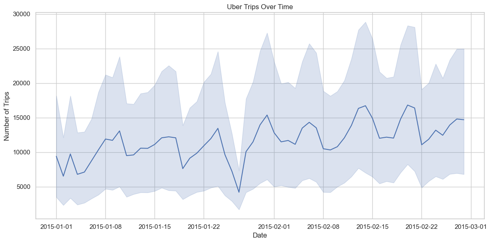
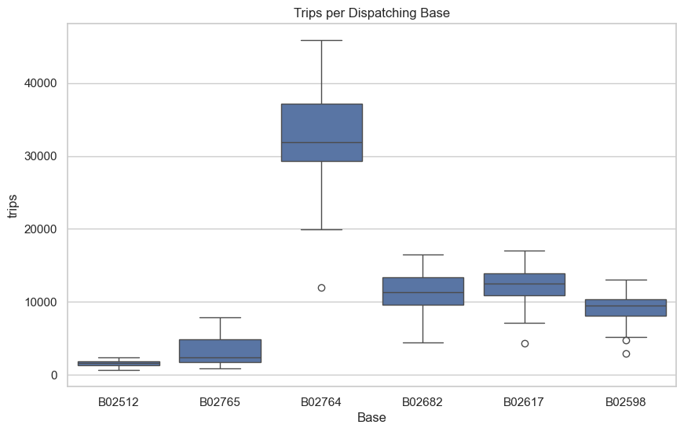

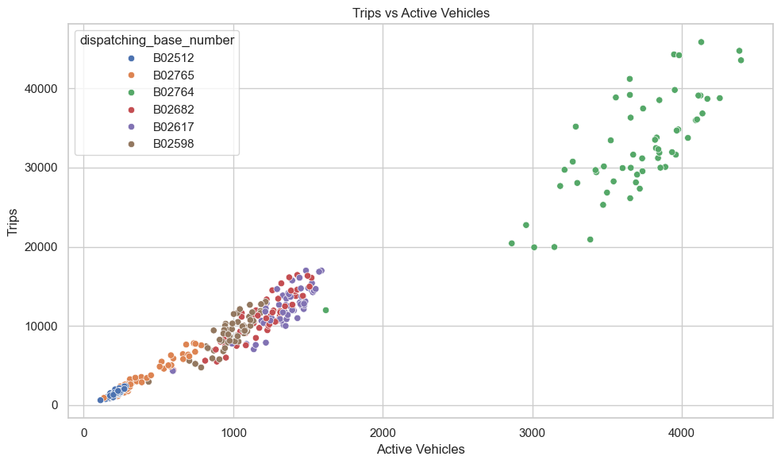
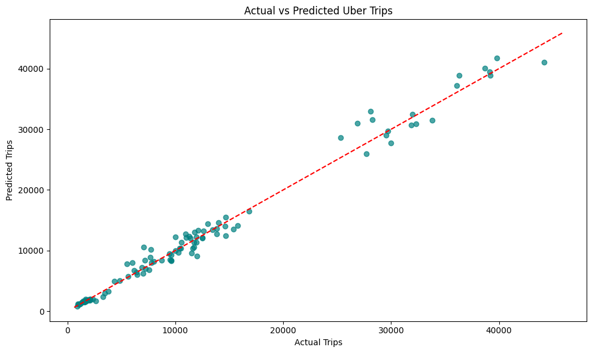

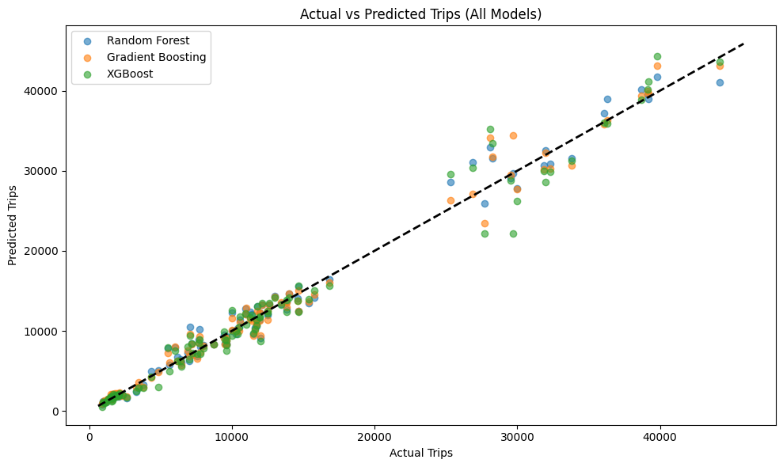
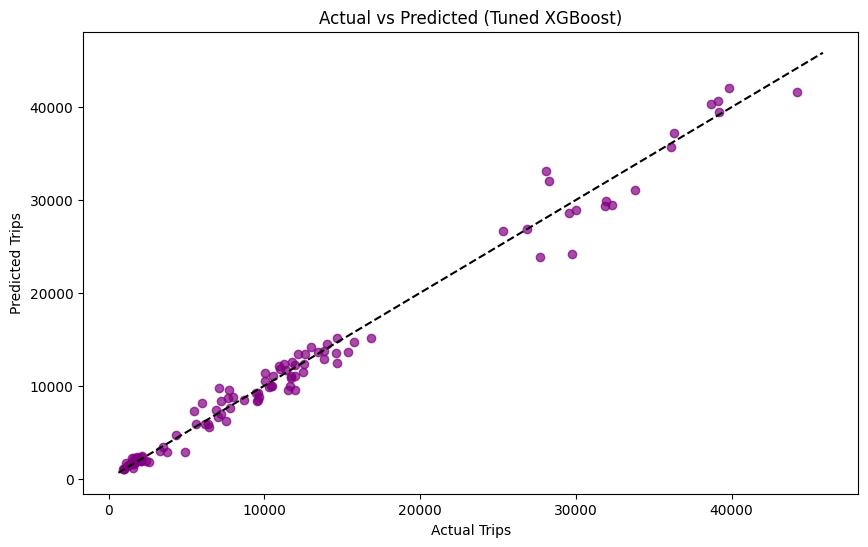
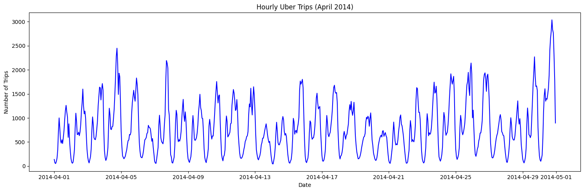
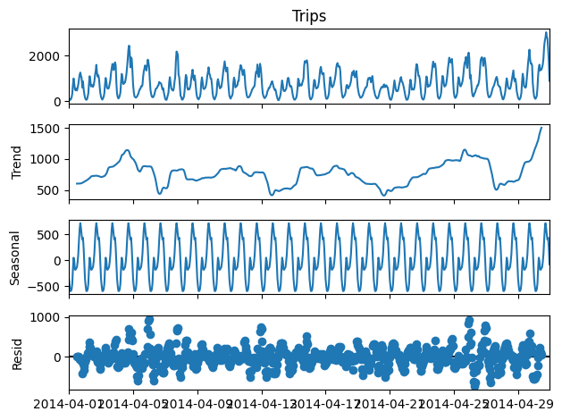
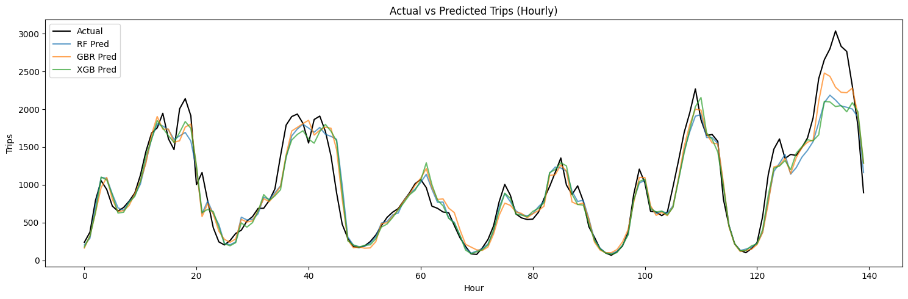

---

## 📈 **Dashboards**
### Dashboard 1:
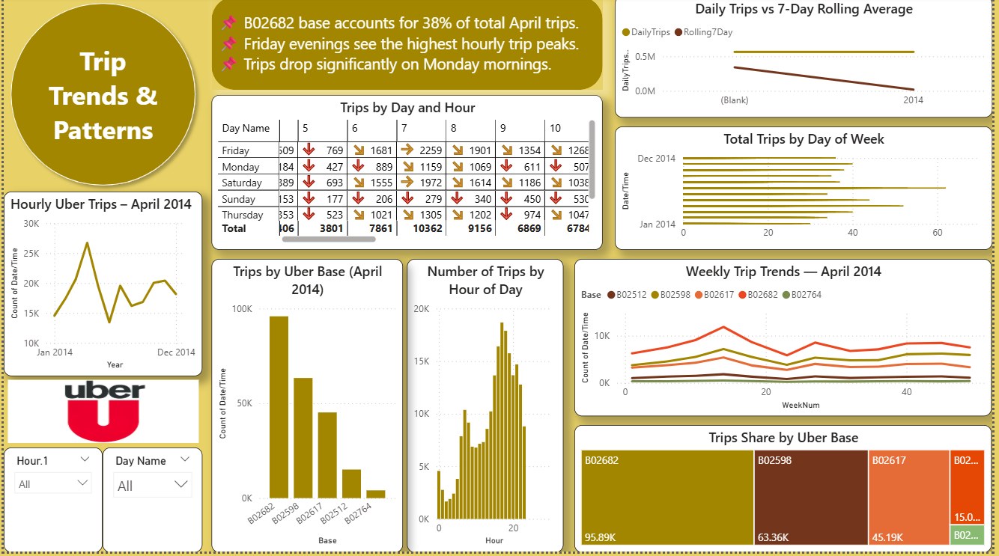

### Dashboard 2:
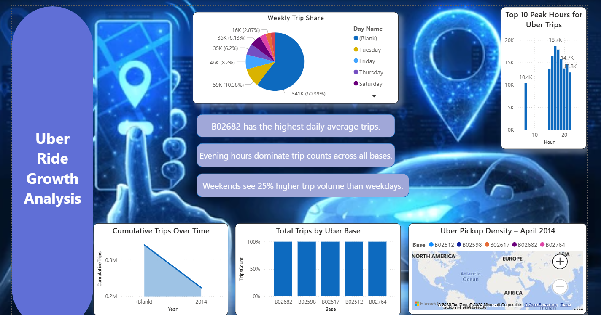

### Dashboard 3:

## 📥 **Download Power BI File**
👉[Click here to download the Power BI file](Uber_Trip_Analysis_Dashboards.pbix)

---

## ✅ **Model Performance**
- **Algorithm Used:** XGBoost Regressor
- **MAE:** 1281.14  
- **RMSE:** 1929.84

---

## 📌 **How to Run the Project**
1. Clone the repository:
   
   git clone https://github.com/your-username/Uber-Trip-Analysis-Project.git
Navigate to project folder:

cd Uber-Trip-Analysis-Project
Open Jupyter Notebook:

jupyter notebook notebooks/uber_trip_analysis.ipynb
📢 Key Insights
Peak demand occurs during weekdays at specific time slots.

Strong positive correlation between active vehicles and number of trips.

Predictive model achieves high accuracy for demand forecasting.

Power BI dashboards provide interactive filtering for date, location, and vehicle count.

📧 Contact
If you found this useful, feel free to ⭐ the repo or connect on https://www.linkedin.com/posts/silla-shaju-309b66322
